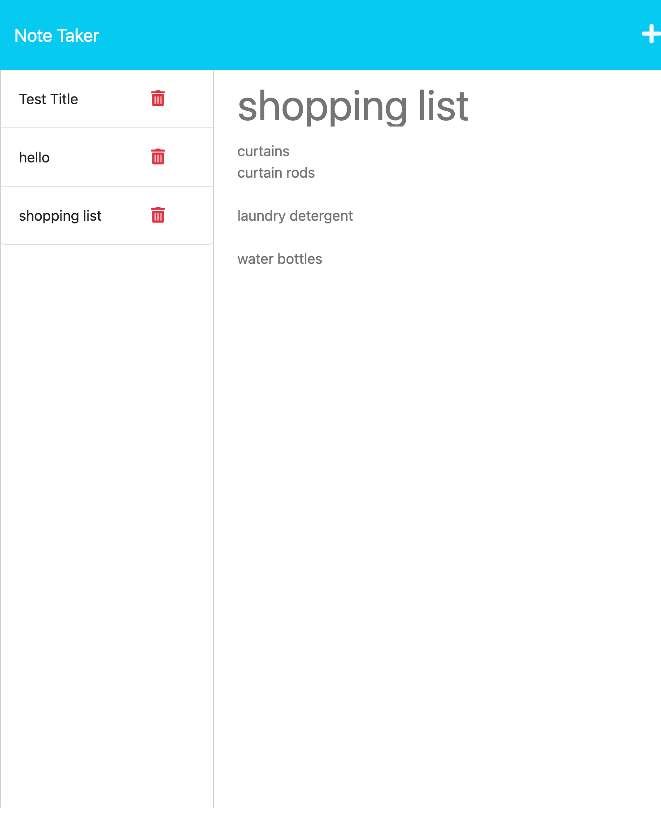

# Note Taker Starter Code

## Description
This is a note taking application. The app saves notes in a database. Future production will allow the user to delete the note.

## Table of contents
- [Installation](#installation)
- [Usage](#usage)
- [Visual Presentation](#visual-presentation)
- [Links](#links)

## Installation
Node, npm, and express are required to run this application. 
Visit https://nodejs.org/en/download/ to install the latest version of Node.js and npm.

## Usage
Once Node and npm are installed, run `npm start` in the command line to begin answering prompts. Answer all prompts thoroughly.

## Visual Presentation

## Links 
GitHub Repo: [https://github.com/jessicashong/note-taker](https://github.com/jessicashong/note-taker)

Heroku Live App: [https://note-taker-jesshong.herokuapp.com/](https://note-taker-jesshong.herokuapp.com/)